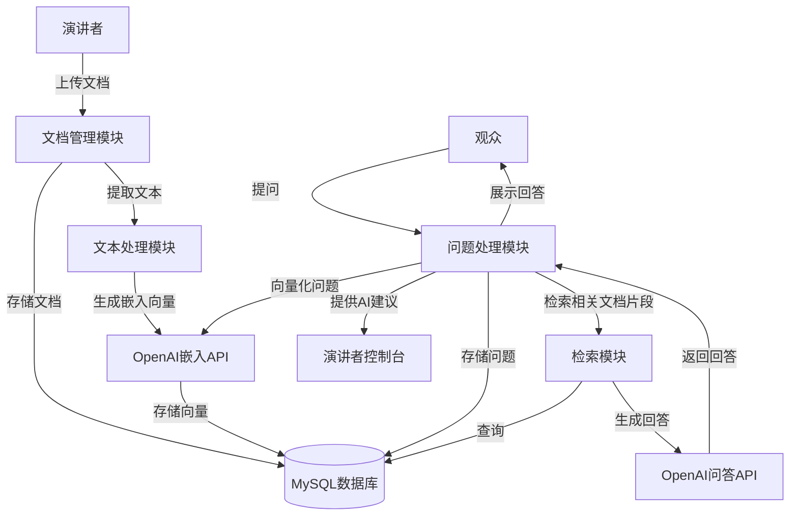

# 演讲互动问答系统知识库功能实施方案

基于需求，本文档提供了一个详细的实施方案，在现有技术栈（Go后端+MySQL数据库+OpenAI API）基础上添加知识库功能，使演讲者能预先上传相关文档，系统能基于这些文档回答观众提问。

## 系统架构设计



## 数据库设计

需要在现有数据库中添加以下表：

```sql
-- 文档表
CREATE TABLE documents (
    id INT AUTO_INCREMENT PRIMARY KEY,
    session_id VARCHAR(50) NOT NULL,
    title VARCHAR(255) NOT NULL,
    file_path VARCHAR(255) NOT NULL,
    file_type VARCHAR(50) NOT NULL,
    upload_time TIMESTAMP DEFAULT CURRENT_TIMESTAMP,
    INDEX idx_session (session_id)
);

-- 文档片段表
CREATE TABLE document_chunks (
    id INT AUTO_INCREMENT PRIMARY KEY,
    document_id INT NOT NULL,
    content TEXT NOT NULL,
    chunk_index INT NOT NULL,
    embedding LONGTEXT, -- 存储OpenAI嵌入向量的JSON字符串
    FOREIGN KEY (document_id) REFERENCES documents(id) ON DELETE CASCADE,
    INDEX idx_document (document_id)
);

-- 修改现有questions表，添加知识库回答字段
ALTER TABLE questions ADD COLUMN kb_suggestion TEXT AFTER ai_suggestion;
```

## 核心功能模块

### 1. 文档管理模块

**功能**：
- 文档上传（支持PDF、PPT、DOCX等格式）
- 文档元数据管理
- 文档与会话关联

**实现要点**：
- 使用Go标准库处理文件上传
- 使用第三方库（如`github.com/unidoc/unipdf`）提取PDF文本
- 使用第三方库（如`github.com/360EntSecGroup-Skylar/excelize`）提取PPT/DOCX文本

### 2. 文本处理模块

**功能**：
- 文档文本提取
- 文本分块（chunk）
- 文本向量化

**实现要点**：
- 将文档分割成适当大小的文本块（如500-1000字符）
- 使用OpenAI的Embeddings API生成文本向量
- 将向量以JSON字符串形式存储在MySQL中

```go
// 文本分块示例
func chunkText(text string, chunkSize int) []string {
    // 实现文本分块逻辑
}

// 生成嵌入向量示例
func generateEmbedding(text string) ([]float32, error) {
    // 调用OpenAI API生成嵌入向量
}
```

### 3. 检索模块

**功能**：
- 问题向量化
- 相似度检索
- 相关文档片段排序

**实现要点**：
- 使用余弦相似度计算问题与文档片段的相似度
- 在Go中实现向量相似度计算
- 检索top-k相关文档片段

```go
// 余弦相似度计算示例
func cosineSimilarity(vec1, vec2 []float32) float32 {
    // 实现余弦相似度计算
}

// 检索相关文档片段示例
func retrieveRelevantChunks(questionEmbedding []float32, sessionId string, topK int) ([]DocumentChunk, error) {
    // 实现检索逻辑
}
```

### 4. 问答生成模块

**功能**：
- 基于检索到的文档片段生成回答
- 结合原有AI建议功能

**实现要点**：
- 使用OpenAI API的上下文提示功能
- 将检索到的文档片段作为上下文提供给模型
- 优化提示模板，确保回答基于文档内容

```go
// 生成知识库回答示例
func generateKnowledgeBaseAnswer(question string, relevantChunks []DocumentChunk) (string, error) {
    // 构建提示模板
    prompt := buildPromptWithContext(question, relevantChunks)
    
    // 调用OpenAI API生成回答
    // ...
}
```

## 前端界面更新

### 1. 演讲者控制台（presenter.html）更新

**新增功能**：
- 文档上传界面
- 已上传文档管理
- 知识库回答展示（与AI建议并列）

**UI设计**：
```html
<!-- 文档上传区域 -->
<div class="document-upload">
    <h3>上传相关文档</h3>
    <form id="uploadForm">
        <input type="file" accept=".pdf,.ppt,.pptx,.doc,.docx" multiple>
        <button type="submit" class="btn btn-primary">上传</button>
    </form>
</div>

<!-- 已上传文档列表 -->
<div class="document-list">
    <h3>已上传文档</h3>
    <ul id="documentList"></ul>
</div>

<!-- 在问题详情模态框中添加知识库回答部分 -->
<div class="question-section">
    <div class="section-title">知识库回答</div>
    <div id="modalKbSuggestion" class="markdown-content"></div>
</div>
```

### 2. 观众提问页面（index.html）更新

**更新要点**：
- 可选择性地展示知识库回答
- 优化问题提交流程

## API接口设计

需要新增以下API接口：

1. **文档上传接口**
   ```
   POST /api/documents
   ```

2. **获取会话文档列表**
   ```
   GET /api/documents/:sessionId
   ```

3. **删除文档接口**
   ```
   DELETE /api/document/:id
   ```

## 实施路线图

### 阶段一：基础设施搭建（2周）

1. 数据库表设计与创建
2. 文档上传与存储功能
3. 文本提取基础功能

### 阶段二：核心功能实现（3周）

1. 文本分块与向量化
2. 相似度检索实现
3. 问答生成功能

### 阶段三：前端集成与测试（2周）

1. 演讲者控制台更新
2. 观众页面优化
3. 系统集成测试

### 阶段四：优化与上线（1周）

1. 性能优化
2. 用户体验改进
3. 部署上线

## 技术挑战与解决方案

1. **向量存储与检索效率**
   - 解决方案：在MySQL中使用JSON格式存储向量，实现Go中的高效向量计算

2. **大文件处理**
   - 解决方案：实现分块上传和异步处理

3. **多格式文档支持**
   - 解决方案：使用专门的库处理不同格式文档

4. **相似度计算性能**
   - 解决方案：实现批量向量计算，优化检索算法

## 未来扩展方向

1. **支持更多文档格式**
   - 添加对更多文档格式的支持，如Markdown、HTML等

2. **知识库管理功能**
   - 添加知识库内容编辑、标记和管理功能

3. **多语言支持**
   - 添加对多语言文档和问答的支持

4. **高级检索功能**
   - 实现混合检索、语义过滤等高级功能